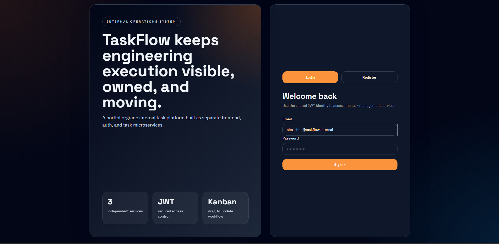
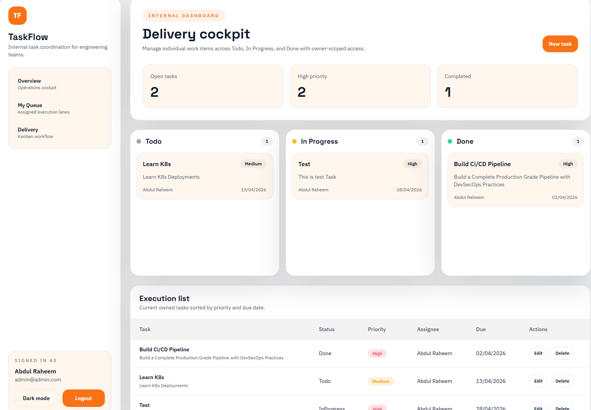
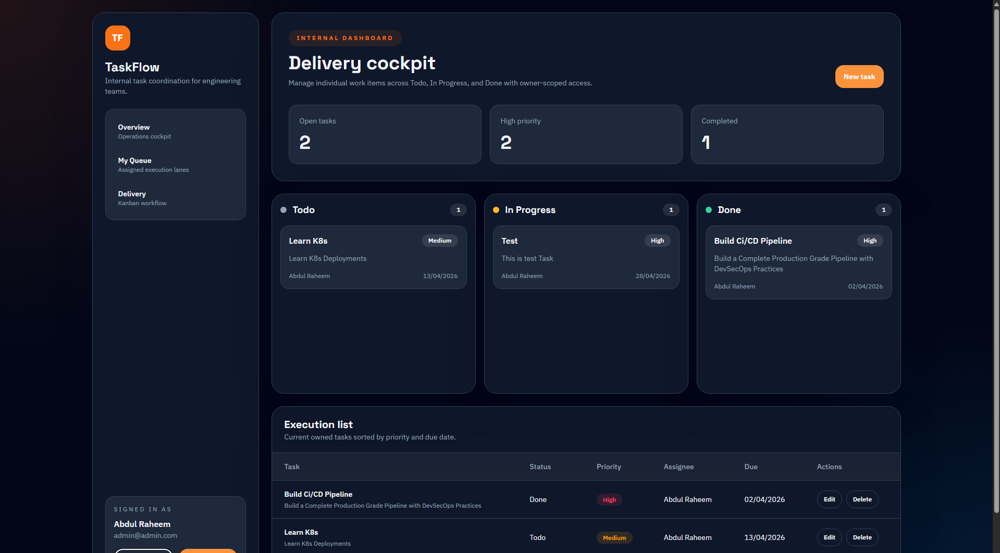

# TaskFlow DevSecOps ECS Pipeline

TaskFlow is a three-service web application wrapped in a DevSecOps CI/CD pipeline. The repository combines:

- A React frontend
- An `auth-service` for registration, login, and JWT-based identity
- A `tasks-service` for task CRUD operations
- GitHub Actions workflows for CI and CD
- Terraform for AWS infrastructure provisioning
- Docker and Docker Hub for container packaging and image distribution

The main goal of this project is to demonstrate a portfolio-ready DevSecOps flow: code changes on `main` trigger security and quality checks, images are built and pushed to Docker Hub, and successful CI can automatically deploy the stack to AWS ECS Fargate. For demo use, the CD workflow also supports a manual `destroy` action so infrastructure can be removed to avoid ongoing cloud cost.

## Screenshots

### Login Page


### Dashboard Light


### Dashboard Dark


## Project Overview

This repository implements a microservices-based task management application and the delivery pipeline around it.

### Application layer

- `frontend`: React + Vite UI served by Nginx
- `auth-service`: Node.js/Express authentication API with JWT and SQLite
- `tasks-service`: Node.js/Express tasks API with SQLite

### DevSecOps layer

- CI on push and pull request to `main`
- Trivy filesystem vulnerability scan
- OWASP Dependency-Check report generation and artifact upload
- SonarCloud code scan
- Docker image build and push to Docker Hub
- CD workflow that applies or destroys AWS infrastructure with Terraform

### Infrastructure layer

- AWS VPC
- Public subnets
- Internet Gateway
- Route table and associations
- Security group
- CloudWatch log group
- ECS cluster
- ECS task definition
- ECS service on Fargate
- Remote Terraform state in S3

## Repository Structure

```text
.
|-- .github/
|   `-- workflows/
|       |-- devsecops-ecs-pipeline.yml
|       `-- cd-pipeline.yml
|-- auth-service/
|-- frontend/
|-- screenshots/
|-- tasks-service/
|-- terraform/
|-- docker-compose.yml
`-- README.md
```

## Architecture

```text
User
  |
  v
Frontend (React + Nginx, port 3000 locally / 8080 in ECS)
  |
  +--> Auth API (Node.js, Express, SQLite, port 4001)
  |
  `--> Tasks API (Node.js, Express, SQLite, port 4002)

GitHub Actions CI
  -> Trivy
  -> OWASP Dependency-Check
  -> SonarCloud
  -> Docker build and push

GitHub Actions CD
  -> AWS credential configuration
  -> Terraform init/apply or destroy
  -> ECS Fargate deployment using Docker Hub images
```

## Tech Stack

### Frontend

- React 18
- Vite
- Tailwind CSS
- React Router
- React DnD
- Axios
- Nginx

### Backend

- Node.js 20
- Express
- SQLite via `better-sqlite3`
- JWT via `jsonwebtoken`
- Password hashing via `bcryptjs`
- Joi validation
- Helmet
- Rate limiting
- Winston logging

### DevOps and Cloud

- GitHub Actions
- Docker
- Docker Buildx
- Docker Hub
- Trivy
- OWASP Dependency-Check
- SonarCloud
- Terraform
- AWS ECS Fargate
- AWS VPC networking
- AWS CloudWatch Logs
- Amazon S3 backend for Terraform state

## Application Features

- User registration and login
- JWT-protected routes
- Authenticated `me` endpoint
- Task creation, update, deletion, and listing
- Kanban-style board with drag-and-drop
- Table view for tasks
- Light and dark theme support
- Health checks for all services
- Containerized local development and deployment

## Services and Ports

| Component | Local Port | ECS Container Port | Purpose |
|---|---:|---:|---|
| Frontend | `3000` | `8080` | Web UI |
| Auth Service | `4001` | `4001` | Registration, login, JWT validation |
| Tasks Service | `4002` | `4002` | Task CRUD |

## API Summary

### Auth service

Base path: `http://localhost:4001/api/auth`

- `POST /register`
- `POST /login`
- `GET /me`
- `GET /health`

### Tasks service

Base path: `http://localhost:4002/api/tasks`

- `GET /`
- `GET /:id`
- `POST /`
- `PUT /:id`
- `DELETE /:id`
- `GET /health`

## CI Pipeline

Workflow file: `.github/workflows/devsecops-ecs-pipeline.yml`

### Trigger

- Push to `main`
- Pull request targeting `main`

### Job sequence

1. `trivy-scan`
2. `owasp-scan`
3. `sonarqube-scan`
4. `build-and-push`

Each later job depends on the previous one with `needs`, so the pipeline runs in order.

### What CI does

#### 1. Trivy filesystem scan

- Scans the repository in filesystem mode
- Looks for OS and library vulnerabilities
- Focuses on `CRITICAL` and `HIGH` severity findings

#### 2. OWASP Dependency-Check

- Scans dependencies in the repository
- Generates an HTML report
- Uploads the report as a GitHub Actions artifact named `owasp-report`

#### 3. SonarCloud scan

- Performs static analysis with SonarCloud
- Uses `SONAR_TOKEN` and the built-in `GITHUB_TOKEN`

#### 4. Docker build and push

- Builds images for:
  - `auth-service`
  - `tasks-service`
  - `frontend`
- Pushes images to Docker Hub on `push` events
- Skips pushing on pull requests
- Tags images with:
  - `latest`
  - `${{ github.sha }}`

### Docker Hub image names

- `abdulraheem381/taskflow-auth-service:latest`
- `abdulraheem381/taskflow-tasks-service:latest`
- `abdulraheem381/taskflow-frontend:latest`

## CD Pipeline

Workflow file: `.github/workflows/cd-pipeline.yml`

### Trigger modes

#### Automatic deployment

The CD workflow listens to completion of the `DevSecOps Pipeline` workflow. If CI finishes successfully, CD can run automatically and apply the Terraform configuration.

#### Manual deployment or destroy

The workflow also supports `workflow_dispatch` with an `action` input:

- `apply`
- `destroy`

This is useful for demo environments where you want to create infrastructure, test the app, and then tear everything down to avoid cost.

### What CD does

1. Checks out the repository
2. Configures AWS credentials from GitHub Secrets
3. Installs Terraform
4. Runs `terraform init`
5. Runs either:
   - `terraform apply --auto-approve`
   - `terraform destroy --auto-approve`

## Terraform Infrastructure

Terraform files are in the [`terraform`](./terraform) directory.

### Backend state

Terraform is configured to use an S3 backend:

- Bucket: `taskflow-terraform-state-abdulraheem`
- Key: `state/terraform.tfstate`
- Region: `ap-south-2`

### Resources provisioned

- `aws_vpc`
- `aws_internet_gateway`
- `aws_subnet` for public subnets
- `aws_route_table`
- `aws_route_table_association`
- `aws_security_group`
- `aws_cloudwatch_log_group`
- `aws_iam_role` for ECS execution
- `aws_iam_role` for ECS task
- `aws_ecs_cluster`
- `aws_ecs_task_definition`
- `aws_ecs_service`

### ECS deployment model

- Launch type: `FARGATE`
- Network mode: `awsvpc`
- Public IP assigned to task
- Frontend is exposed on port `8080`
- Security group allows inbound `8080/tcp` from `0.0.0.0/0`
- Frontend depends on healthy `auth-service` and `tasks-service` containers
- Logs are sent to CloudWatch

### Runtime container images

Terraform deploys these images by default through `terraform.tfvars`:

- `abdulraheem381/taskflow-frontend:latest`
- `abdulraheem381/taskflow-auth-service:latest`
- `abdulraheem381/taskflow-tasks-service:latest`

## Required GitHub Secrets

To run the workflows successfully, configure these repository secrets:

| Secret | Purpose |
|---|---|
| `DOCKERHUB_USERNAME` | Docker Hub account/user name |
| `DOCKERHUB_TOKEN` | Docker Hub access token |
| `SONAR_TOKEN` | SonarCloud authentication |
| `AWS_ACCESS_KEY_ID` | AWS access key for Terraform deploy/destroy |
| `AWS_SECRET_ACCESS_KEY` | AWS secret key for Terraform deploy/destroy |

## Local Development

### Option 1: Run with Docker Compose

```bash
docker-compose up --build
```

Open:

- Frontend: `http://localhost:3000`
- Auth API: `http://localhost:4001/health`
- Tasks API: `http://localhost:4002/health`

### Option 2: Run each service manually

#### Frontend

```bash
cd frontend
npm install
npm run dev
```

#### Auth service

```bash
cd auth-service
npm install
npm run dev
```

#### Tasks service

```bash
cd tasks-service
npm install
npm run dev
```

### Environment files

The repository includes example environment files:

- `frontend/.env.example`
- `auth-service/.env.example`
- `tasks-service/.env.example`

Frontend variables:

```env
VITE_AUTH_API_URL=http://localhost:4001/api/auth
VITE_TASKS_API_URL=http://localhost:4002/api/tasks
```

Auth service variables:

```env
PORT=4001
NODE_ENV=development
JWT_SECRET=change-me-to-a-long-random-secret
JWT_EXPIRES_IN=8h
DB_PATH=./data/auth.db
CORS_ORIGIN=http://localhost:3000
LOG_LEVEL=info
```

Tasks service variables:

```env
PORT=4002
NODE_ENV=development
JWT_SECRET=change-me-to-a-long-random-secret
DB_PATH=./data/tasks.db
CORS_ORIGIN=http://localhost:3000
LOG_LEVEL=info
```

## Docker Details

### Frontend image

- Multi-stage build
- Built with Node.js
- Served with Nginx
- Exposes `8080`

### Backend images

- Based on `node:20-alpine`
- Install production dependencies only
- Run as non-root user
- Expose `4001` and `4002`
- Include container health checks

## Security Controls in the App

- JWT authentication
- Password hashing with `bcryptjs`
- Joi request validation
- Helmet headers
- Express rate limiting
- Per-service health checks
- Structured request and error logging

## Deployment Flow

1. Developer pushes code to `main` or opens a pull request to `main`
2. CI starts the security and quality jobs
3. If the workflow reaches the image stage, Docker images are built
4. On non-PR events, images are pushed to Docker Hub
5. A successful CI run can trigger the CD workflow
6. CD initializes Terraform against the remote S3 backend
7. Terraform provisions or updates AWS networking and ECS resources
8. ECS pulls images from Docker Hub and starts the application

## Destroy Flow

For demonstration and cost control, the project includes a manual destroy path.

1. Open the `CD Pipeline` workflow in GitHub Actions
2. Select `Run workflow`
3. Choose `destroy`
4. Run the workflow
5. Terraform reads the remote state from S3 and destroys the provisioned resources

This keeps the project demo-friendly and avoids leaving AWS resources running unnecessarily.

## Important Implementation Notes

- The CD workflow region is set to `ap-south-2`.
- Terraform variable default for `aws_region` is `us-east-1`, but `terraform.tfvars` overrides it to `ap-south-2`.
- The current CI workflow uses SonarCloud, not a self-hosted SonarQube server.
- The current Trivy step is configured with `exit-code: '0'`, which means it reports findings but does not fail the job by itself. If you want Trivy to hard-fail CI on detected vulnerabilities, change that value to `1`.
- The current ECS deployment exposes the frontend directly with a public IP and security group on port `8080`; there is no Application Load Balancer in this repository.

## How This Project Fits a DevSecOps Portfolio

This project demonstrates:

- Secure-by-default application development
- Containerized microservices
- Shift-left security scanning in CI
- Automated artifact creation and registry publishing
- Infrastructure as Code with Terraform
- Automated deployment to AWS ECS Fargate
- Controlled teardown for low-cost demos

It is suitable as a hands-on DevSecOps portfolio project because it shows the full path from source code to security checks to cloud deployment.

## License

This project is licensed under the MIT License - see the [LICENSE](LICENSE) file for details.

